# POST DEPLOYMENT STEPS FOR AWX V19.3 (deployed using solution hub)

## 1)Once the AWX deployment is complete. Go to RMS Jobs

## 2)Click on Outputs

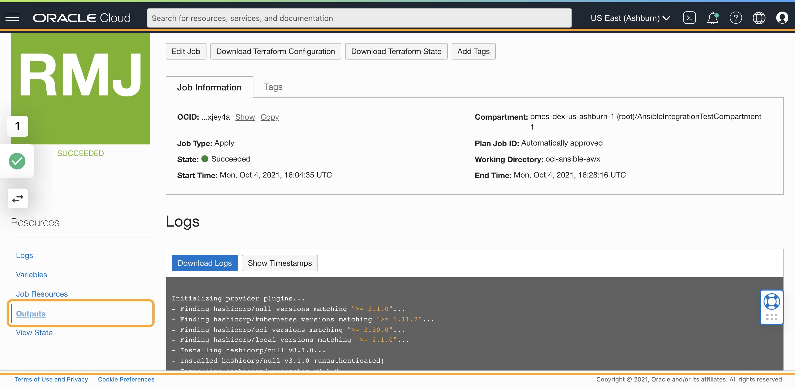

## 3)Copy "awx_ui_ip" value and paste in the browser

## 4)AWX Login page

## 5)Type "admin"

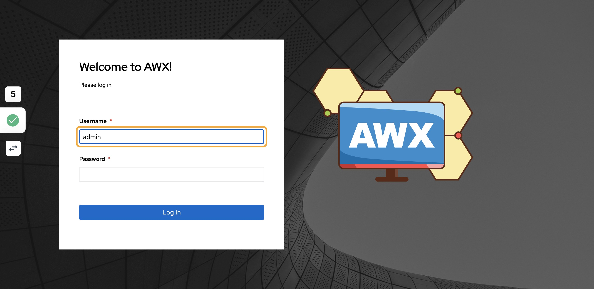

## 6)Go back to RMS Job output and copy "awx_login_password" value

## 7)Go to AWX

## 8)Paste the password and click on Log In

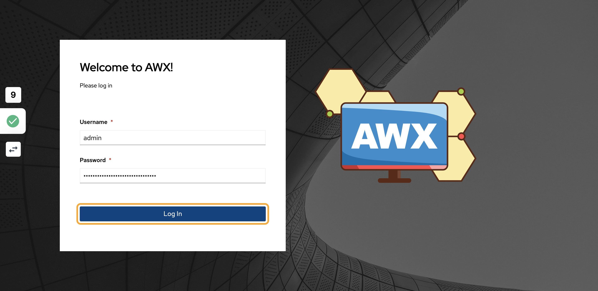

## 9)Create a docker image for execution environment and publish the docker image in your tenancy docker registery

This docker image should install OCI Python SDK which is pre-requisite for OCI Ansible Collection.

- Refer:
  - <https://docs.ansible.com/automation-controller/latest/html/userguide/execution_environments.html#build-ee>
  - <https://www.oracle.com/webfolder/technetwork/tutorials/obe/oci/registry/index.html>

## 10)Go to Execution environments, click on OCI_EXECUTION_ENVIRONMENT, click edit, provide the newly created docker image name and save it

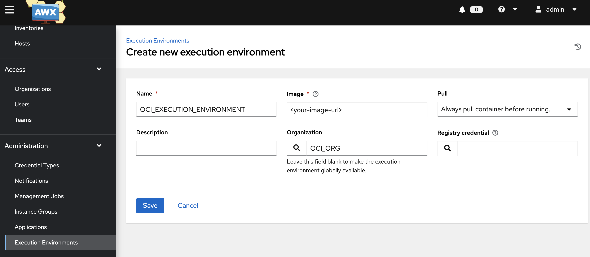

## 11)Click on Credentials

## 12)Click on Add

## 13)Provide any name for credentials

## 14)Search Organization

## 15)Select OCI_ORG

## 16)Click on Select Credential Type

## 17)Select OCI

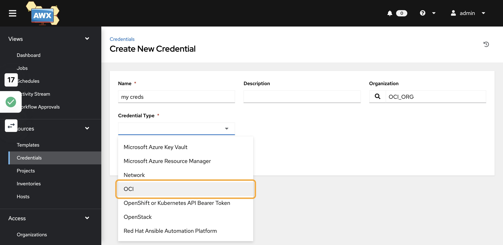

## 18)You should see the newly created credential

## 19)Now Click on Inventories

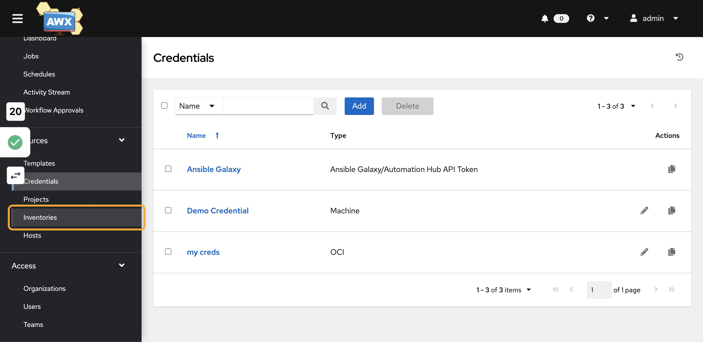

## 20)Click on OCI_INVENTORY and then Click on Sources

## 21)Click on Edit Source and Search for Credential

## 22)Select the credential created in the previous step

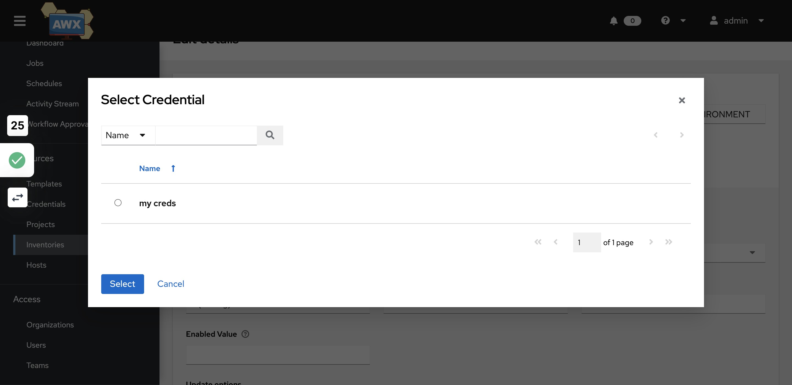

## 23)Click on Save

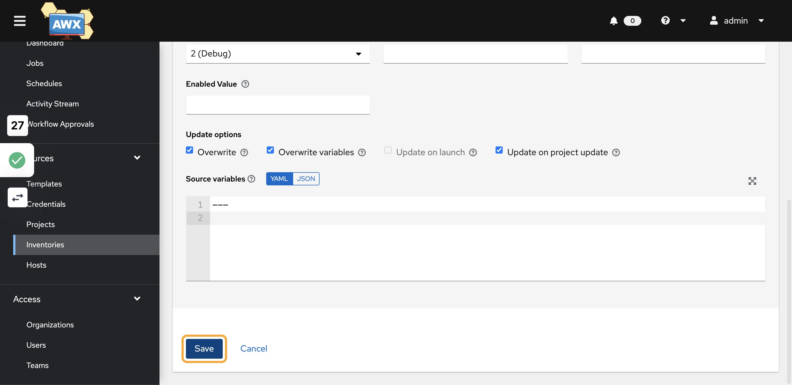

## 24)Next step is to add project. so click on Projects

## 25)Click on Add and provide the project name

## 26)Search for Organization

## 27)Select OCI_ORG

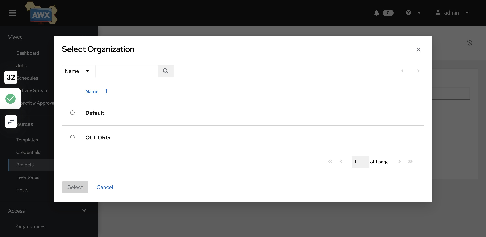

## 28)Search for Execution environment

## 29)Select OCI_EXECUTION_ENVIRONMENT

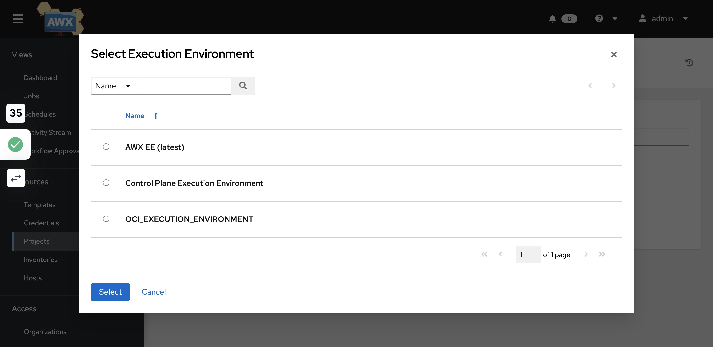

## 30)Select Git

## 31)Provide the Git repo url of your project

## 32)Select "Clean" , "Delete" and "Update Revision on Launch"

## 33)Click on Save

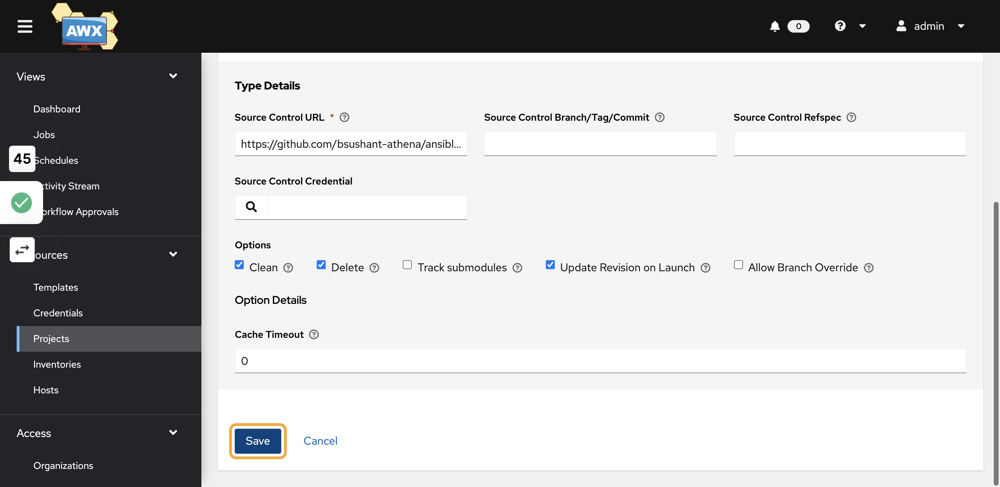

## 34)Project creation status can be seen on the Jobs link

## 35)Click on Inventories

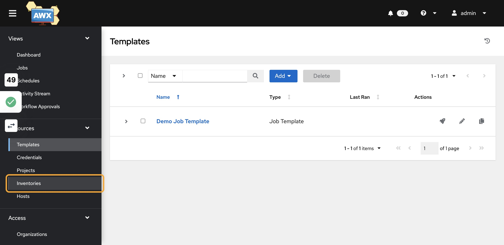

## 36)Select " OCI_INVENTORY" and click on Sources

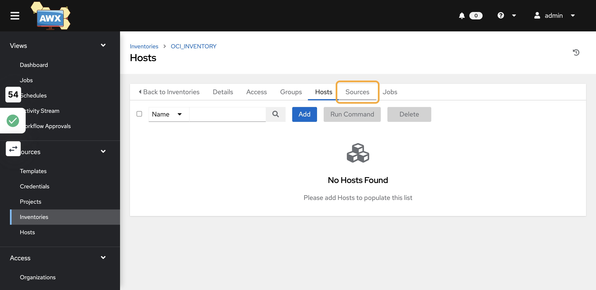

## 37)Click on Start sync process

## 38)Click on Jobs to view status of inventory fetch

## 39)Click on Templates

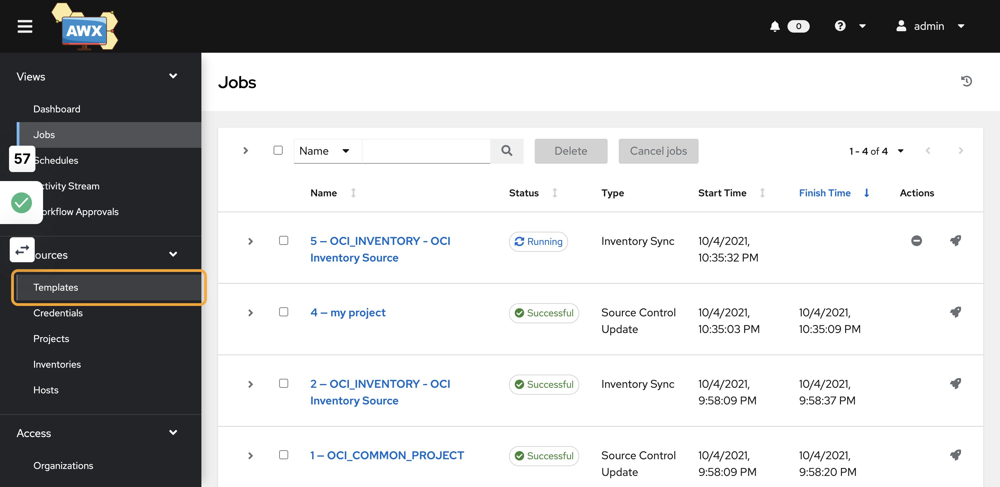

## 40)Click on Add and select "Add job template"

## 41)Provide Template details

## 42)Search for the Inventory

## 43)Select OCI_INVENTORY

## 44)Search for the Project

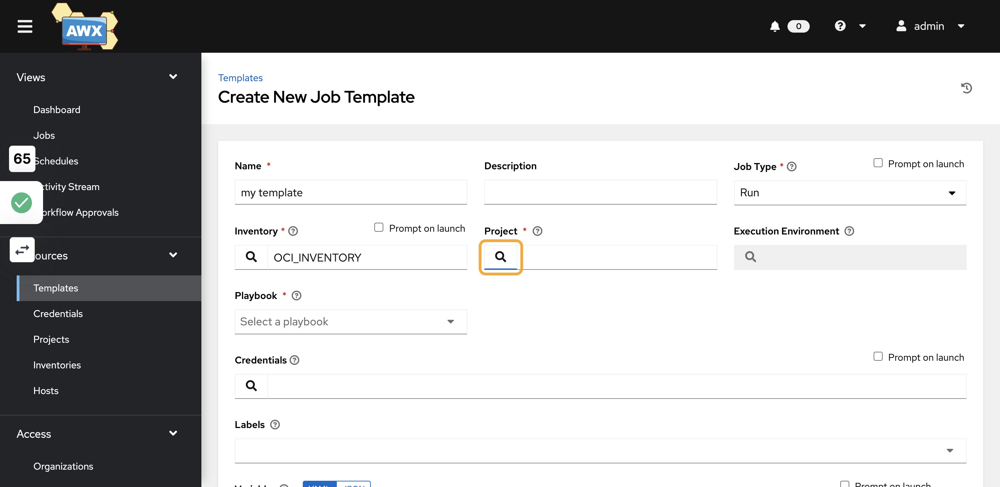

## 45)Select the project you created in the last step

## 46)Search for Execution environment

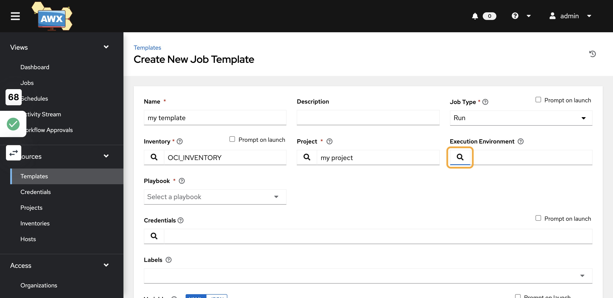

## 47)Select OCI_EXECUTION_ENVIRONMENT

## 48)Click on Select a playbook

## 49)Select a playbook to run

Note: these playbooks should be available in your project git repo
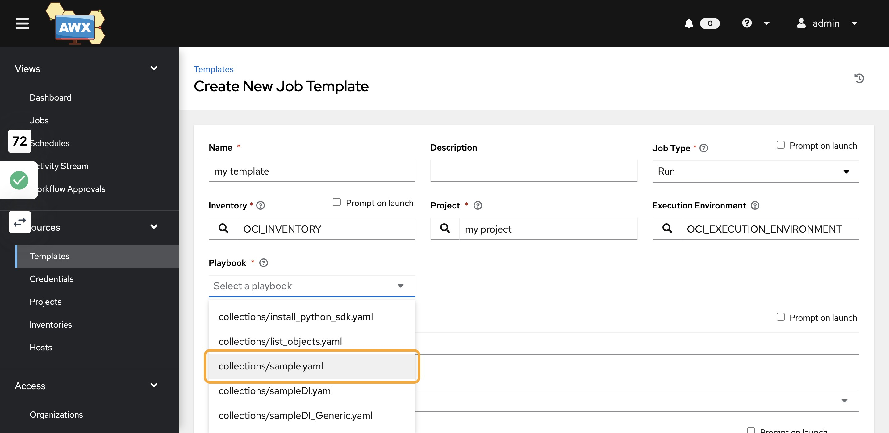

## 50)Search for credentials

## 51)Select OCI

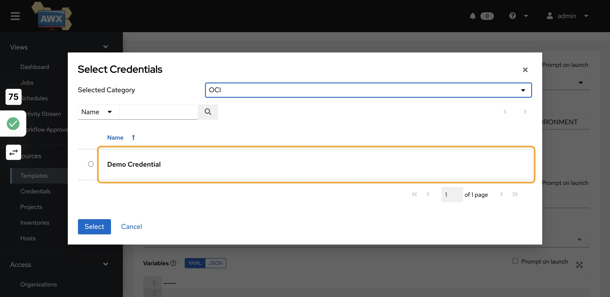

## 52)Select the creds you created

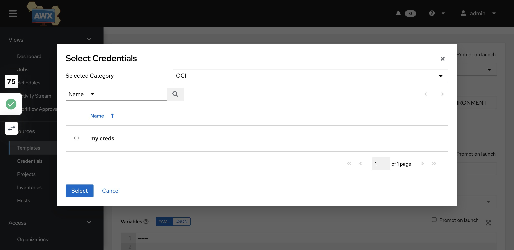

## 53)Click on Save

## 54)Click on Launch

## 55)Click on Jobs to see template status

## 56)Click on Hosts to see if the hosts are fetched or not

Note: If hosts are fetched that means dynamic inventory is available
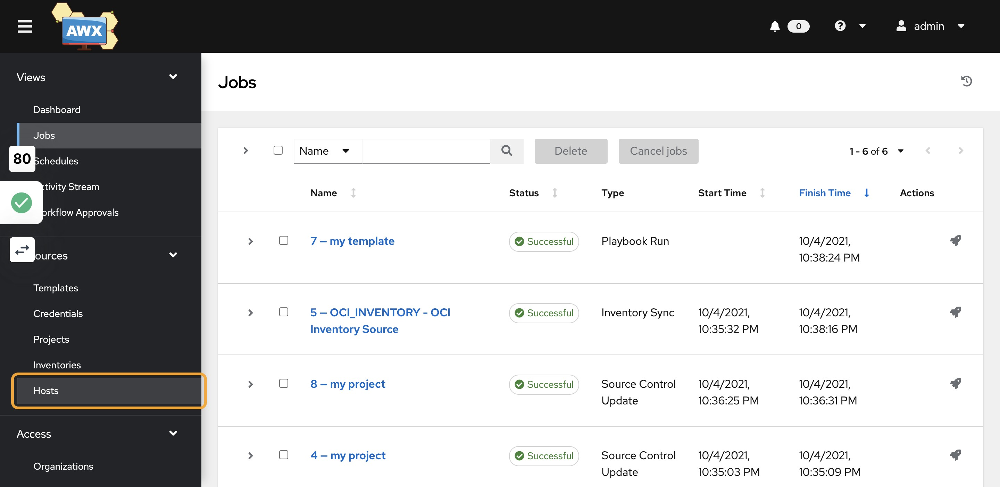
