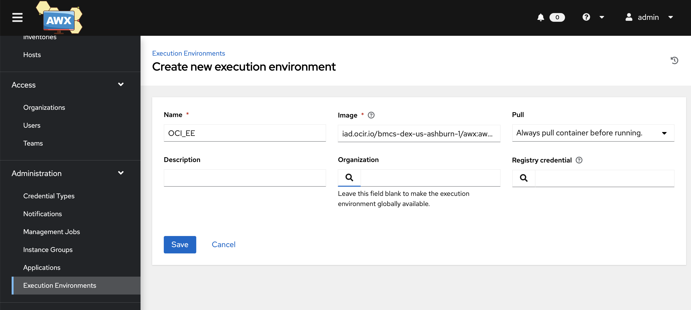
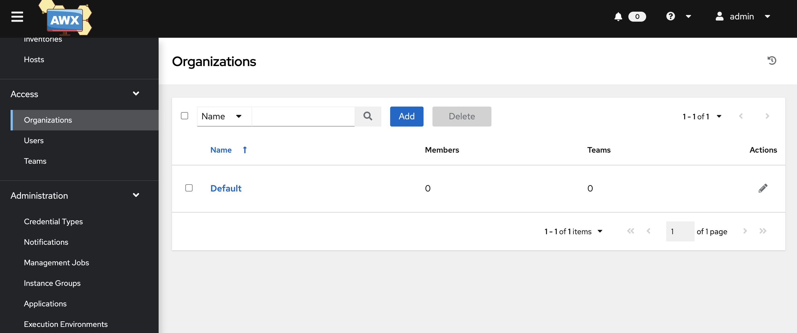
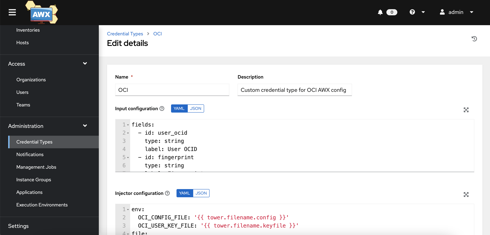
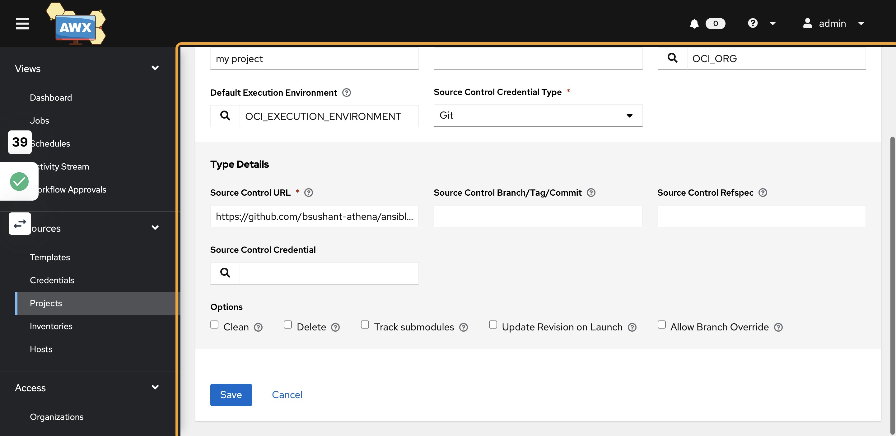
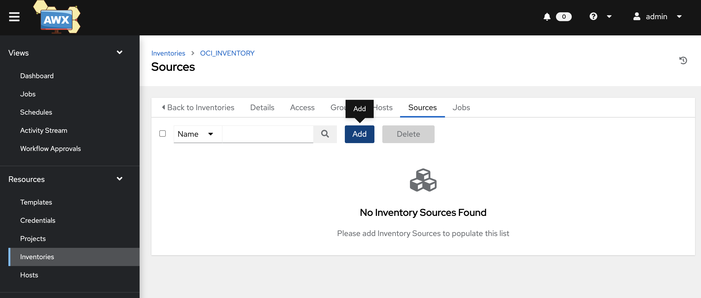

# POST DEPLOYMENT STEPS FOR AWX V19.3 (deployed manually)

## 1)Once the AWX deployment is complete. Log In into AWX UI and add Execution environment

The OCI collection depends on the OCI Python SDK to run.
To install the SDK, we have created a docker image which installs the OCI Python SDK.


## 2)Add details for the execution environment details

Provide the images value `iad.ocir.io/bmcs-dex-us-ashburn-1/awx:awxv19.2.2-latest`
WARNING: THIS IMAGE IS NOT MAINTAINED AND MIGHT HAVE SECURITY ISSUES


## 3)Add organization



## 4)Add details for the Organization


## 5)Add credential type


## 6)Provide credential type values

Input Configuration:

```yaml
fields:
  - id: user_ocid
    type: string
    label: User OCID
  - id: fingerprint
    type: string
    label: Fingerprint
  - id: tenant_ocid
    type: string
    label: Tenant OCID
  - id: region
    type: string
    label: Region
  - id: private_user_key
    type: string
    label: Private User Key
    secret: true
    multiline: true
required:
  - user_ocid
  - tenant_ocid
  - region
  - fingerprint
  - private_user_key
```

Injector Configuration:

```yaml
env:
  OCI_CONFIG_FILE: '{{ tower.filename.config }}'
  OCI_USER_KEY_FILE: '{{ tower.filename.keyfile }}'
file:
  template.config: |-
    [DEFAULT]
    user={{ user_ocid }}
    fingerprint={{ fingerprint }}
    tenancy={{ tenant_ocid }}
    region={{ region }}
  template.keyfile: '{{ private_user_key }}'
```



## 7)Create Git repo and add the playbooks. Follow below folder structure

```text
├── collections
│   └── requirements.yml
└── inventory.oci.yml
```

The inventory.oci.yml file contains the following details for the inventory plugin:

```bash
$ cat inventory.oci.yml
plugin: oracle.oci.oci
regions: all
fetch_db_hosts: true
```

Create a [requirements file](https://docs.ansible.com/ansible/latest/user_guide/collections_using.html#install-multiple-collections-with-a-requirements-file) at collections or requirements.yml that looks like the following string:

```bash
$ cat collections/requirements.yml
collections:
  - name: oracle.oci
```

## 8)Add Project and provide the details



## 9)Add Inventory


## 10)Provide Inventory details


## 11)Add Inventory source



## 12)Add Inventory source details by providing proper values which you created in previous steps


## 13)Finally synchronize the inventory to fetch the hosts/groups


Follow further steps from `AWX post deployment steps (deployed using Solution Hub)` starting from #36 till end.

REFERENCE: <https://github.com/ansible/awx-operator>
