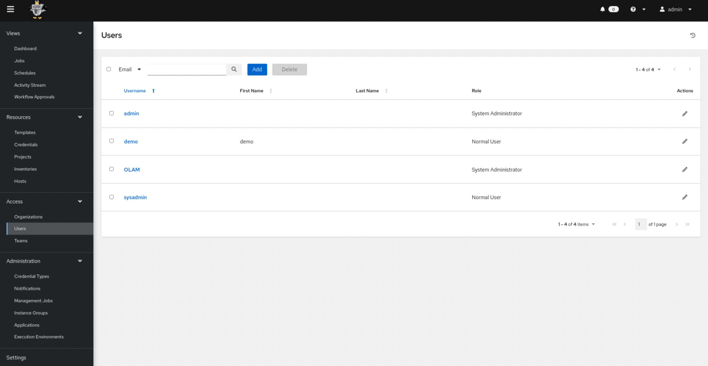
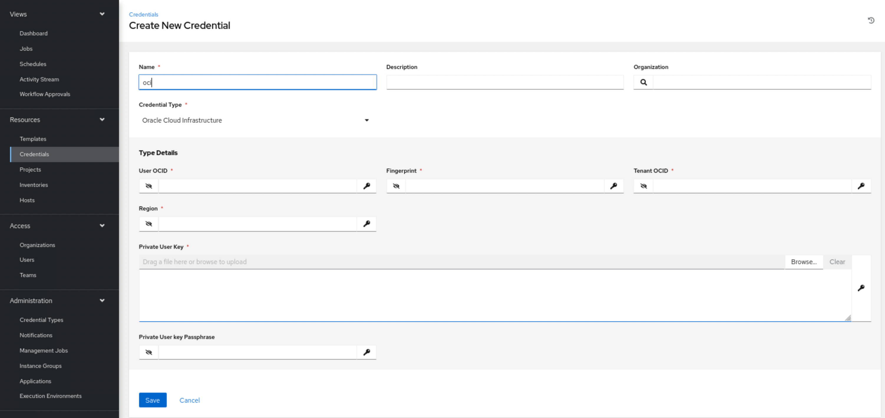
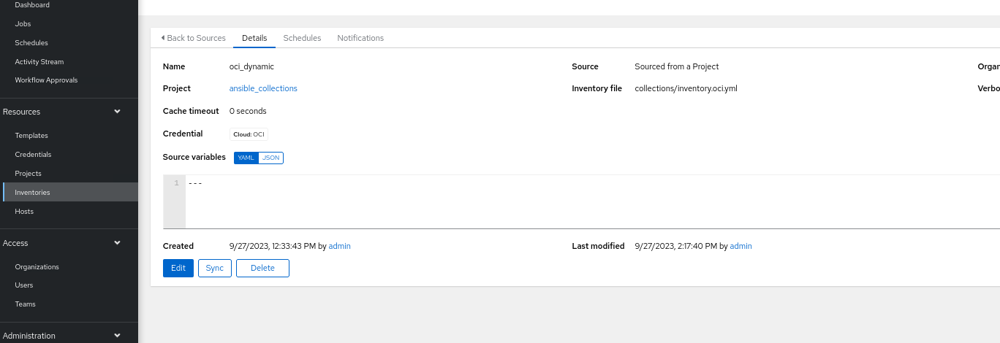
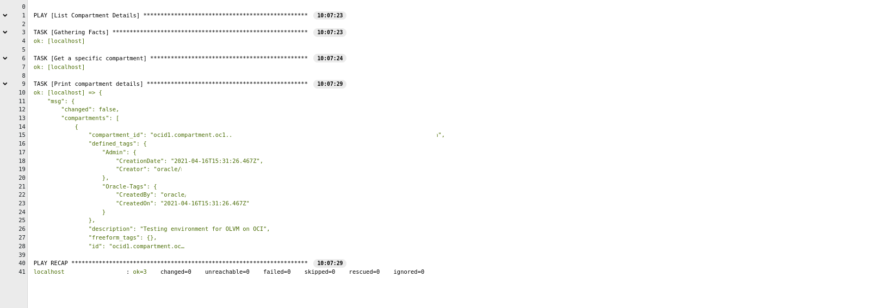

# Oracle Linux Automation Manager on OCI

## Introduction
Oracle Linux Automation Manager is an automation tool for deploying software, configuring systems, and orchestrating tasks such as upgrades and updates, in the form of playbooks.
Based on the open source project AWX, this tool provides a Web interface for scheduling and running playbook tasks on the inventories the playbooks interact with. 
The Oracle Cloud Infrastructure (OCI) Ansible Collection provides an easy way to provision and manage resources in the Oracle Cloud using Ansible. The same collections can be leveraged from Oracle Linux Automation Manager to automate and manage Oracle Cloud Infrasturcture from Oracle Linux Automation Manager.

## Installation
Oracle Linux Automation  Manager can be installed on Oracle Linux 8 OCI instance itself or any On-Premise machines that can connect to OCI Environment.
Refer to this quick [tutorial](https://docs.oracle.com/en/learn/olam-install/index.html#introduction) for installing Oracle Linux Automation Manager.

## Post Deployment Steps

Post installing Oracle Linux Automation Manager, here are some of the configuration steps that need to be performed:

* By default, only Admin user gets created with Superuser privileges. Setup required Users, Teams, Organizations. 

* Starting Oracle Linux Automation Manager v2, there is dedicated Credential type for OCI. Create a new OCI Credential and provide User OCID, Fingerprint, Tenancy OCID, Region and Private User Key.

  
* Proceed to create Inventories. Oracle Linux Automation Manager uses inventory to work against managed nodes or hosts in your infrastructure. This inventory contains a list of servers, their IP addresses, and other optional connection information.
A static inventory file works well if your infrastructure hardly changes.
However, your infrastructure is likely in constant flux when using the cloud. Therefore it would be great to have a way to have your inventory dynamically updated as hosts come and go.
Please refer to this [demo](https://www.youtube.com/watch?v=Fs3l5P-D_nk&t=190s) on setting up Dynamic Inventory.

* Create a SCM based Project pointing to Git repositories that contains the Playbooks and importantly a requirements.yml to fetch OCI Ansible Collections. Refer to instructions documented [here](https://docs.oracle.com/en/learn/olam-oci-collection/#introduction).
  
* Create a Execution Environment that includes OCI Ansible Collections. Features such as The Builder Utility and Private Automation Hub can be used to customize Execution Environments. Example on creating Execution Environment is documented here:[Builder-Utility](https://docs.oracle.com/en/learn/olam-builder-custom/#introduction), [Private Automation Hub](https://docs.oracle.com/en/learn/olam-pah-manage-ee/#summary), [Using Execution Environments](https://docs.oracle.com/en/learn/olam-use-custom-ee/#add-a-host) in Oracle Linux Automation Manager.
  
* Create a Template pointing to the playbook and with all the above resources created.
  Here is an example output of a Job that lists the compartment details from OCI.
  

  

## Documentation
Elaborate documentation on Installation, User's Guide, and Administration is available below. Kindly refer to the provided information.
| Name | Link |
| ------ | ------ |
| Installation Guide | [Oracle-Linux-Automation-Manager-2](https://docs.oracle.com/en/operating-systems/oracle-linux-automation-manager/2/install/#Oracle-Linux-Automation-Manager-2) |
| Creating Resources | [SettingUpPermissionsforOrganizationsTeamsandUsers](https://docs.oracle.com/en/operating-systems/oracle-linux-automation-manager/2/user-guide/awx-SettingUpPermissionsforOrganizationsTeamsandUsers.html#awx-about-access) |
| CLI and API Guide | [CLI and API Guide](https://docs.oracle.com/en/operating-systems/oracle-linux-automation-manager/2/olam-api-cli/) |
| Training and Tutorials | [Training and Tutorials](https://oracle-samples.github.io/oltrain/tracks/olam/) |
| Sample OCI Playbooks | [Sample OCI Playbooks](https://github.com/oracle-samples/ansible-collections/tree/main/playbooks/OCI) |

