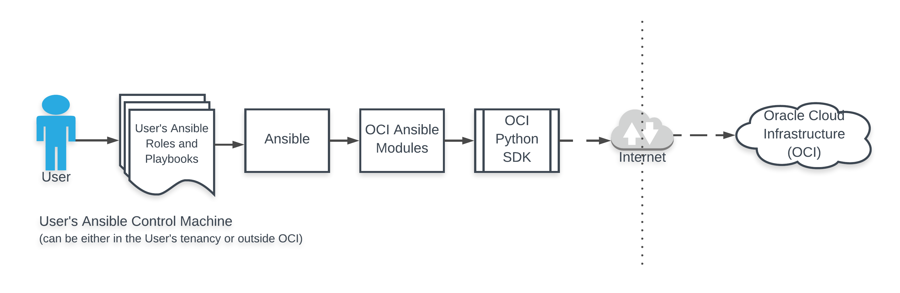

# Oracle Cloud Infrastructure Ansible Modules - Features, Architecture, Technical Details
 
## 1. Introduction

Configuration Management (CM) and Infrastructure Automation tools, such as [Ansible](https://docs.ansible.com/ansible/latest/), are widely used by DevOps professionals and system administrators to achieve “Infrastructure as Code”. These tools help system administrators
- declare the "desired state" of their infrastructure (and optionally "actions" to reach the desired state), and have these CM tools provision the infrastructure, and configure, maintain or repair if it diverges from that "desired state".
- reduce risk by ensuring repeatable infrastructure provisioning and configuration 
- help achieve speed/agility by automating common deployment/configuration tasks
- provide visibility and audit-ability of configuration management operations

This project aims to help OCI (Oracle Cloud Infrastructure) users provision, configure and manage OCI infrastructure using Ansible.

## 2. Overview of Ansible

Ansible is one of the leading open source tools for automation of infrastructure provisioning, configuration management and application deployment. Ansible's simple DSL (YAML) for declaring configuration and infrastructure tasks is easy to get started and expressive. Its agent-less architecture reduces the overhead on the network by preventing the nodes from polling the controlling machine.

Ansible also has an "batteries-included" approach, and bundles a lot of Modules with it (this group of modules is informally called as the `Ansible Module Index`). Most of the built-in modules are contributed by the Ansible Community. 

## 3. Objectives

- Feature-rich implementation that DevOps professionals and system administrators can use to provision and configure OCI Services and resources
- Wide support of OCI services - ensure that the most common OCI Services (Compute, Storage, Network, Load Balancer, Database Service) are handled. Subsequent releases would incrementally add support for features and new Services
- Leverage the [Oracle Python SDK](https://oracle-cloud-infrastructure-python-sdk.readthedocs.io/en/latest/) for all [OCI API](https://docs.us-phoenix-1.oraclecloud.com/api/) interactions
- Follow Ansible guidelines and best practices around module development - integration tests, documentation alignment etc

## 4. Design Goals

- Layered on top of the OCI Python SDK. The OCI Ansible cloud modules would use the OCI Python SDK to interact with the [OCI API](https://docs.us-phoenix-1.oraclecloud.com/api/). The OCI Ansible modules supports and honour the SDK configuration [4] when available. This ensures that the standard SDK configuration that is already configured by a user is used by OCI ansible modules.
- Provide a uniform interface to users for functions that are common across various OCI resources - tagging resources, waiter logic to wait for resources to reach the desired state, authentication overrides, controlling idempotency

## 5. Overview



## 6. Implementation Details

### 6.1 Supported Services

In the current version of the OCI Ansible modules, the following Services are supported:
- Block Volume
- Compute
- Container Engine for Kubernetes Service (OKE)
- Database (including support for Autonomous Transaction Processing and Autonomous Data Warehouse Services)
- Edge Services (DNS, WAF)
- IAM
- Load Balancing
- Networking
- Object Storage
- File Storage
- Email Delivery
- Search

Support for the following Services are not yet implemented. They would be implemented in future releases.
- Audit
- Archive Storage
- Key Management Service

### 6.2 Prerequisites

Apart from Ansible, the OCI Ansible modules only require a properly configured installation of the [OCI Python SDK](https://oracle-cloud-infrastructure-python-sdk.readthedocs.io/en/latest/) to function. 

### 6.3 Installation

We recommend (though, not require) installation of these modules and its pre-requisites in a virtual-env. The ansible modules can be installed through an installer script (the installer script ensures that the various artifacts associated with the modules (such as documentation fragments, utility libraries and the modules) are placed in the right places for the Ansible implementation to pick up).


### 6.4 Dynamic Inventory

Ansible can be configured to work with hosts provisioned in OCI using a static `inventory` file. However this approach may not work well, as OCI compute instances may come and go over time, or be created or managed by other external tools (API, console, SDK, Terraform etc). Ansible supports the `inventory` to be specified dynamically through a `dynamic inventory script`. We provide an [Oracle Cloud Infrastructure(OCI) Ansible Dynamic Inventory Script](docs/dynamic-inventory-script.md) in this project that users can use to ensure that the latest set of OCI compute instances are dynamically fetched and available for their playbooks to be executed upon. The dynamic inventory has a rich set of options for a user to control how information about targets are fetched, and group the fetched information along different dimensions, so that they can be used appropriately in playbooks.

### 6.5 Authentication

The OCI Ansible modules supports and honour the [OCI SDK configuration](https://oracle-cloud-infrastructure-python-sdk.readthedocs.io/en/latest/configuration.html) when provided by the user. We recommend that users employ the standard OCI SDK configuration (and its profiles support) to control the authentication information to be used for executing a Play in production.

So if a user has a SDK configuration file (`~/.oci/config`) as described in the [OCI SDK configuration documentation](https://docs.us-phoenix-1.oraclecloud.com/Content/API/Concepts/sdkconfig.htm) with their correct Tenancy and User OCIDs and API keys, when an ansible playbook that refers to OCI ansible modules is executed, the OCI ansible modules would use the authentication information configured in the SDK configuration file to authenticate the connection, and perform the action on an OCI resource.

In development and testing scenarios, if an administrator wants to override the authentication information for an individual playbook, or a play, or an ad-hoc execution, the authentication information can be overridden through the following means:
- Ansible module options: For instance to override the Region to connect to in a single play within a playbook, the user can specify an OCI ansible module option named "region", and the ansible module would use the value specified by "region" over the value specified in ~/.oci/config to configure the SDK to connect to OCI.
- Environment variables: For instance to override the Region to connect to, the user can specify an environment variable named "OCI_REGION", and the ansible module would use the value specified by "OCI_REGION" to configure the SDK to connect to OCI.

All authentication attributes that can be specified through the SDK configuration file, can be overridden using a corresponding Ansible module or an environment variable. We don't recommend the use of Environment variables (for security reasons) and ansible module options (for security reasons and because this would make the playbook tied to a specified tenancy/user) in production.

#### 6.6 Security and IAM Guidelines

The OCI Ansible Modules uses the authentication information specified in the standard [OCI SDK configuration file](https://oracle-cloud-infrastructure-python-sdk.readthedocs.io/en/latest/installation.html#configuring-the-sdk) while creating and configuring OCI resources. 

Caution: IAM credentials referenced in the OCI SDK configuration file, grants access to resources. It is important to secure these credentials to prevent unauthorized access to Oracle Cloud Infrastructure resources. Recommendations to secure the IAM credentials in the controller node where you run ansible playbooks that uses these modules, are described in the "Credentials Management" section of the [OCI IAM whitepaper](https://cloud.oracle.com/iaas/whitepapers/best-practices-for-iam-on-oci.pdf) at the [OCI IAM documentation](https://docs.us-phoenix-1.oraclecloud.com/Content/Security/Reference/iam_security.htm#IAMCredentials).

The OCI Ansible Modules allows the authentication information specified in the OCI SDK configuration file to be overridden using module options and environment variables as described in Section 6.5. Please refer to the ansible module documentation of the OCI Ansible Modules for more details. We recommend the use of OCI SDK configuration file to specify authentication information. Use the "profiles" feature in the OCI SDK configuration file to support different users. The use of environment variables and ansible module options to override Authentication information must be avoided in production scenarios. While distributing roles that use the OCI Ansible Modules, ensure that no IAM credentials are included with the roles.

### 6.6 Logging/Telemetry

Logging of requests to OCI can be enabled by setting log levels in the OCI Python SDK and the OCI Ansible Modules:
-  Set the `log_requests` variable in your ~/.oci/config to `True` to enable Request logging in the OCI python SDK as described in https://github.com/oracle/oci-python-sdk/blob/master/docs/logging.rst
-  Export an environment variable to enable DEBUG mode for our Ansible modules
```sh
$ export LOG_LEVEL="DEBUG"
```

All subsequent debug messages from an ansible playbook execution using the OCI Ansible Modules
`$ ansible-playbook …`
would go to `/tmp/oci_ansible_module.log` (the default logging location for our modules).

### 6.7 Retries/Backoff

OCI Ansible modules uses OCI Python SDK's waiter support for jittered backoff to retry API operations that failed with connection timeouts or retryable Service errors. The modules uses the OCI Python SDK's support for checking connection timeouts and retryable Service errors.

For all resource actions that support intermediate states before reaching the desired lifecycle state, the OCI ansible modules (by default) automatically wait until the Resource reaches the desired state before completing a play. The user can override this behaviour and choose not to wait until the desired lifecycle state is reached.

### 6.8 Idempotency

Ansible recommends that all the modules be idempotent, so that repeated playbook executions by users result in reaching the desired state quickly and reliably. Unless documented explicitly in the module's `ansible-doc`, all resource lifecycle operations initiated through OCI Ansible Modules are idempotent. To forcefully perform a non-idempotent creation of a resource, use the `force_create` option.

## 7. Samples

A set of samples are included along with the modules to demonstrate the usage of the OCI ansible modules. These samples cover the breadth of OCI Services that the modules support. The latest list of Samples are available in the [Samples](samples) directory.
