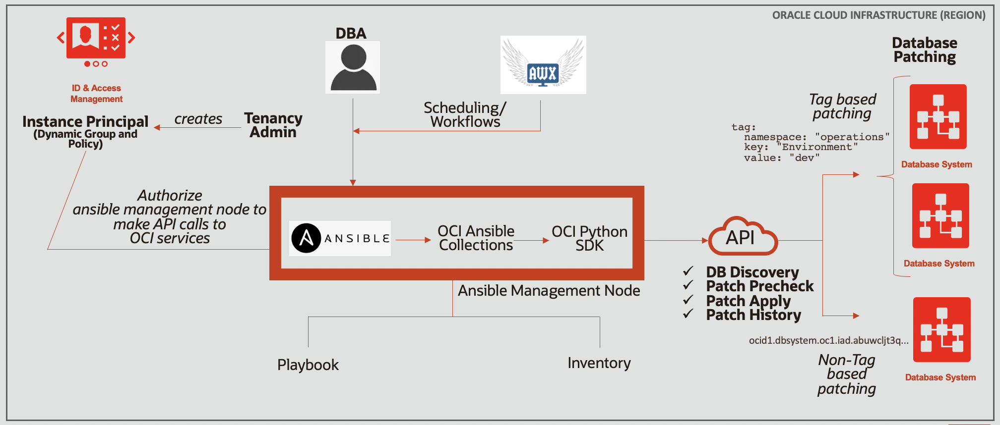

# Oracle Cloud Infrastructure Database System Patching using OCI Ansible Collection

The automation can be used to patch database systems on Oracle Cloud Infrastructure using OCI Ansible collection.
It can be used for two use cases of database system patching.

1. **Tag based database system patching** - Patch Oracle Cloud Infrastructure database system(s) on the basis of defined tag. The automation discover candidate databases for patching with defined tag in a compartment or tenancy and then patches them sequentially.

2. **Non-Tag based database system patching** - Patch Oracle Cloud Infrastructure database system(s) on the basis of OCID (Oracle Cloud Identifier). The automation can take one or more OCIDs of database systems as input and patches them sequentially.

## **Architecture**



The architecture contains an Ansible Management node for centralized patching of Oracle Cloud Infrastructure databases. The Ansible Management node runs under an OCI tenancy where database systems are required to be patched. It has Ansible, Oracle Cloud Infrastructure Ansible collection and Python SDK.  The management node uses instance principal based authentication and authorization to patch database systems using API calls. The tenancy administrator creates a dynamic group and a policy to authorize ansible management node to make API calls to database systems for patching. Using instance principal and API calls, the automation patches Grid Infrastructure as well as database without logging on database nodes.

For more information on Oracle Cloud Infrastructure database service, see [Oracle Cloud Infrastructure Database Service](https://docs.cloud.oracle.com/iaas/Content/Database/Concepts/databaseoverview.htm)

For more information on Oracle Cloud Infrastructure Ansible Collection, see [Oracle Cloud Infrastructure Ansible Collection](https://github.com/oracle/oci-ansible-collection)


## **Prerequisites**

The only pre-requisite for automation is to create an Ansible Management Node.

#### **Ansible Management Node creation using OCI Resource Manager**
1. Click [![Deploy to Oracle Cloud][magic_button]][magic_dbpatching_stack]

   If you aren't already signed in, when prompted, enter the tenancy and user credentials.

2. Review and accept the terms and conditions.

3. Select the region where you want to deploy the stack.

4. Follow the on-screen prompts and instructions to create the stack.

5. After creating the stack, click Terraform Actions, and select Plan.

6. Wait for the job to be completed, and review the plan.
   
   To make any changes, return to the Stack Details page, click Edit Stack, and make the required changes. Then, run the Plan action again.

7. If no further changes are necessary, return to the Stack Details page, click Terraform Actions, and select Apply. 

## **Inputs required for database system patching**

The following inputs are required in **dbpatching/host_vars/localhost.yml** file to run database patching operation

| Argument                   | Description                                                                                                                                                                                                                                                                                                                                                       |
| -------------------------- | ----------------------------------------------------------------------------------------------------------------------------------------------------------------------------------------------------------------------------------------------------------------------------------------------------------------------------------------------------------------- |
| tag_based                         | Whether patch database systems on the basis of tag. This is a mandatory boolean parameter that can be set to either True or False. When set to "True", the patching will be performed for databases in compartment (or tenancy) with defined tag. e.g. - "defined_tags.operations.environment='dev'". When set to "False", the patching will be performed for databases defined using db_system_id parameter. |
| tag                   | This is an ansible dictionary variable which defines the tag to be used to discover database systems for patching. This is a required parameter when tag_based is True.                                                                                                                                                                                                    |
| compartment_id              |  It can be set either to a compartment ocid or tenancy ocid. When set to compartment_ocid, all databases with defined tag in compartment will be discovered for patching. When set to tenancy_ocid, all databases with defined tag in tenancy will be discovered for patching. This is a required parameter when tag_based is "True".                                                                                                                                                                                                                                                                                                                            |
| db_system_id           | This parameter is an ansible list variable that contains list of OCIDs of all the databases to be patched. The parameter can accept one or more OCIDs for patching. This is a required parameter when tag_based is "False".                                                                                                                       |
| patch_operation                   | This is an ansible dictionary variable that defines boolean values for patching operations - precheck_gi, patch_gi, precheck_db, patch_db. Setting an operation to "True" runs that operation and setting an operation to "False" skips an operation.                                                                                                                                                                                                                                                                                                                               |
#### **Sample dbpatching/host_vars/localhost.yml file**

```yaml
---

#Copyright © 2020, Oracle and/or its affiliates.
#The Universal Permissive License (UPL), Version 1.0

#file: host_vars/localhost.yml


######################
# tag_based - Mandatory parameter - Can be True or False
# When True - Tag based patching - Patch databases on the basis of defined_tag.
    #################### Tag based patching ##################################################################
    # Patch databases with tag (e.g. - "defined_tags.operations.environment='dev'" ) in compartment or tenancy
    # tag and compartment_ocid is mandatory when tag_based is True
        # When compartment_id = <compartment_ocid>, patch all databases with defined tag in compartment
        # When compartment_id = <tenancy_ocid>, patch all databases with defined tag in tenancy
    ##########################################################################################################
# When False - Non-Tag based patching - Patch databases on the basis of database system ocid.
    #################### Tag based patching ##################################################################
    # Patch databases with database system ocid
    # tag and compartment_ocid is mandatory when tag_based is True
        # When compartment_id = <compartment_ocid>, patch all databases with defined tag in compartment
        # When compartment_id = <tenancy_ocid>, patch all databases with defined tag in tenancy
    ##########################################################################################################

tag_based: False
 
# tag - Required when tag_based is True 
# Dict
tag:
    namespace: "operations"
    key: "Environment"
    value: "dev"

# compartment_id - Required when tag_based is True 
compartment_id: ocid1.compartment.oc1..aaaaaaaa

# db_system_id - Required when tag_based is False
db_system_id:
    # DB1 - 12c
    - ocid1.dbsystem.oc1.iad.abuwcljt3q...
    # DB2 - 18c
    - ocid1.dbsystem.oc1.iad.abuwcljrk4...
    # DB3 - 11g
    - ocid1.dbsystem.oc1.iad.abuwcljs3q...
    # DB4 - 19c
    - ocid1.dbsystem.oc1.iad.abuwcljtxx...

# Patch operation to run - Required
patch_operation: 
    precheck_gi: True
    patch_gi: True
    precheck_db: True
    patch_db: True
```

## **How to use automation for patching**

1) SSH to Ansible Management Node.

    ```
    $ cd oci-db-patching
    ```

2) Update **dbpatching/host_vars/localhost.yml** with required parameters.

3) Run patchdb.sh to apply the patch as per defined variables

    ```
    $ ./patchdb.sh
    ```
[magic_button]: https://oci-resourcemanager-plugin.plugins.oci.oraclecloud.com/latest/deploy-to-oracle-cloud.svg
[magic_dbpatching_stack]: https://cloud.oracle.com/resourcemanager/stacks/create?&zipUrl=https://github.com/oracle/oci-ansible-collection/solutions/db-patching/dbpatching-mgmtnode.zip
