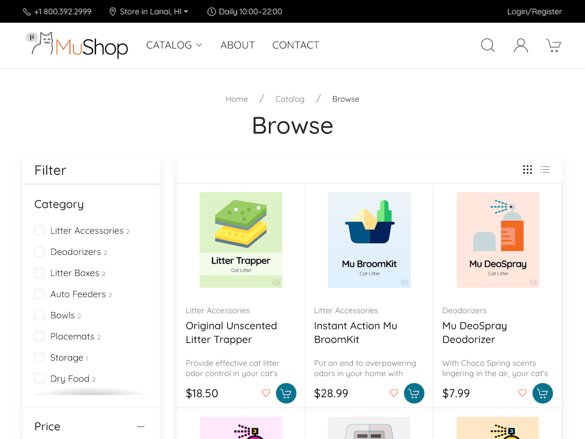
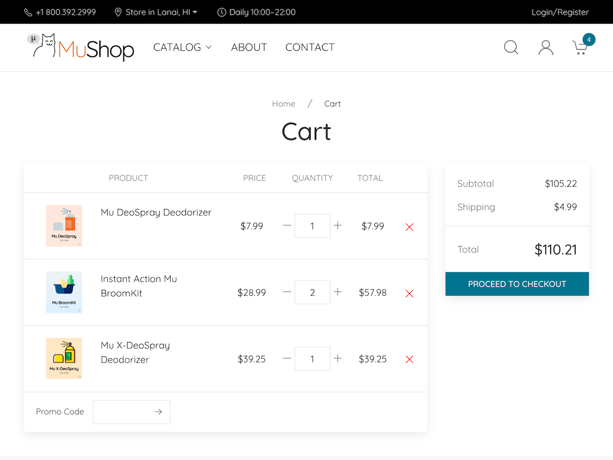

## MuShop


---
MuShop is a showcase of several [Oracle Cloud Infrastructure][oci] services in a unified reference application. The sample application implements an e-commerce platform built as a set of micro-services. The accompanying content can be used to get started with cloud native application development on [Oracle Cloud Infrastructure][oci].

|  |  |  |  |
|---|---|---|---|

MuShop can be deployed in different ways to explore [Oracle Cloud Infrastructure][oci] based on your subscription. Both deployment models can be used with trial subscriptions. However, [Oracle Cloud Infrastructure][oci] offers an *Always Free* tier with resources that can be used indefinitely.

| [Basic: `free`](#Getting-Started-with-MuShop-Basic) |
|--|
| Simplified runtime utilizing **only** [Always Free](https://www.oracle.com/cloud/free/) resources. Deployed using [Ansible][ansible] |

```text
oci-ansible-free
└── playbooks
    └── site.yml
```

---
#### Instructions
Environment variable OCI_TENANCY is required to be set. OCI_ANSIBLE_FREE_PUBKEY is needed only if the key file needs to be modified
```
export OCI_TENANCY="ocid1.tenancy.oc1..aaaaaa EXAMPLE TENANCY OCID"
export OCI_ANSIBLE_FREE_PUBKEY=~/.ssh/id_rsa.pub   # This is default, only set if you need to modify
```

### Getting Started with MuShop Basic

This is a Ansible configuration that deploys the MuShop basic sample application on [Oracle Cloud Infrastructure][oci] and is designed to run using only the Always Free tier resources.

The repository contains the application code as well as the [Ansible][ansible] code to create MuShop deployment.

The steps below guide you through deploying the application on your tenancy using the OCI Resource Manager.

1. Checkout this repo on the `master` branch
2. Follow the setup instructions above
3. Execute: `ansible-playbook playbooks/site.yml`
4. Answer `yes` at the confirmation or append `-e auto_confirm=True` to the above execution command.

All the resources will be created, and the URL to the load balancer will be displayed as `lb_public_url` as in the example below.

```text
Outputs:

autonomous_database_password = <generated>

lb_public_url = http://xxx.xxx.xxx.xxx
```

> The application is being deployed to the compute instances asynchronously, and it may take a couple of minutes for the URL to serve the application.

#### Cleanup

Even though it is Always Free, you will likely want to terminate the demo application
in your Oracle Cloud Infrastructure tenancy.

Follow these steps to completely remove all provisioned resources:

1. Checkout this repo on the `master` branch
2. Follow the setup instructions above
3. Execute: `ansible-playbook playbooks/teardown.yml`
4. Answer `yes` at the confirmation or append `-e auto_confirm=True` to the above execution command.

##### Topology

The following diagram shows the topology created by this stack.


---
[oci]: https://cloud.oracle.com/en_US/cloud-infrastructure
[ansible]: https://www.ansible.com
